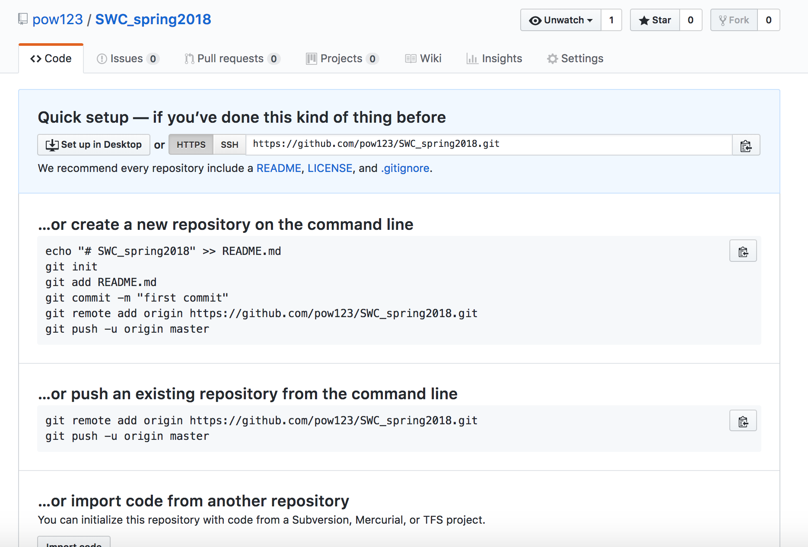

Software Carpentry Workshop: Lesson 6: Introduction to Git and Github
===

SWC workshop, February 22
Instructor: Peace
Time: 1.5 hours

This lesson is a modified version of [Software Carpentry Git Lesson](http://swcarpentry.github.io/git-novice/) and part of the UTA Spring 2018 [Software Carpentry workshop](https://annawilliford.github.io/2018-02-24-UTA/).

Additional resources:
[tutorials](https://www.atlassian.com/git/tutorials)
[pull requests](https://help.github.com/articles/creating-a-pull-request-from-a-fork/)

## 1. What is Git/GitHub and why you would want to use it

Does this look familiar?


**Git**
Git is a version control software. It is used to track changes in documents on your local machine. All file versions and revision history are saved to a folder known as **repository**.

Version control systems start with a base version of the document and then save just the changes you made at each step of the way. You can think of it as a tape: if you rewind the tape and start at the base document, then you can play back each change and end up with your latest version.


Once you think of changes as separate from the document itself, you can then think about “playing back” different sets of changes onto the base document and getting different versions of the document. For example, two users can make independent sets of changes based on the same document.


Unless there are conflicts, you can combine two sets of changes onto the same base document.


**GitHub** is a cloud service that hosts repositories, it is a central hub to hold all our local repositories. GitHub has additional functionality that enables efficient collaboration.


As you can see, there are many ways users can interact with remote repositories. The main advantage here is to have access to repositories other than your own, a framework that promotes collaboration. Before exploring Github, let's understand how to make reposotories and track files on your local machines.

## 2. Setting up Git

Git should be already installed on your machines. If you are on Windows, Git came with your gitbash installation. If you are on Mac, Git has been preinstalled on your system.


When we use Git on a new computer for the first time, we need to configure a few things. Below are a few examples of configurations we will set as we get started with Git:

- our name and email address,
- to colorize our output,
- what our preferred text editor is,
- and that we want to use these settings globally (i.e., for every project)

On a command line, Git commands are written as `git verb`, where `verb` is what we actually want to do. The flag `--global` tells Git to use the setting for every project in your user account on this computer.

```shell
$ git config --global user.name "your username"
$ git config --global user.email "your email" 
$ git config --global color.ui "auto"
```
Next, choose from one of the following commands below to add a text editor of your choice.

```shell
#Mac: BBEdit
 $ git config --global core.editor "BBEdit -w"

#Mac: Sublime Text
$ git config --global core.editor "subl -n -w"

#Windows: notepad
$ git config --global core.editor "notepad"

#Windows: notepad++
$ git config --global core.editor "C:/Program Files (x86)/Notepad++/notepad++.exe"

#Linux
$ git config --global core.editor "gedit --wait --new-window"
```

You can check your settings at any time:
```shell
$ git config --list
```
`git config` command has other options. You can get help with this and other git commands by typing
```shell
$ "YourCommand" -h
$ git config -h
$ git config --help
```
So far we have only used `git config` command, but there are many more. You can get an idea about the functionality of Git by taking a look at the available commands.
```shell
$ git
```
We will explore some of them next.

## 3. Track your documents with Git

Let's use Git now that it's been configured. We’ll do our work in the `SWC_spring2018` folder. Check where you are using `pwd`. To change your working directory, use the `cd` command.
```shell
cd SWC_spring2018
```

To start with, let's make a new folder `git_test` in the `SWC_spring2018` directory.

Let’s create a directory for our work and then move into that directory. Suppose you started working on your thesis. Create a directory within `git_test`. 
```shell
#go to git_test
cd git_test

#make folder
$ mkdir Thesis

#go into Thesis folder
$ cd Thesis

#check Thesis contents (list files)
$ls
```

There is nothing, as expected. To show hidden files, add the flag `-a`.
```shell
$ ls -a 
./  ../ 
```
At this point we have the expected output. Let's make a new file in this folder, say a file for thesis notes. The file, titled "notes.txt" will contain the text "Chapter 1 notes.
```shell
$ echo "Chapter 1 notes" > notes.txt

#Now, listing contents, we see the added file.
$ ls
notes.txt
```
Let's read the contents of the file with the `cat` command.
```shell
$ cat notes.txt
```
We can ask now if our new file, `notes.txt` is being tracked. We can do this with `git status` command.
```shell
$ git status
fatal: Not a git repository (or any of the parent directories): .git
```
This message means that `Thesis` folder is not under the control of Git, and none of the documents within this folder are being tracked.

To place a folder under Git control, we need to initialize our `Thesis` folder to make it a repository—a place where Git can store versions of our files:

```shell
#check that you are in Thesis
$ pwd

#initialize Thesis directory with Git
$ git init
Initialized empty Git repository in .../Thesis/.git/

#check contents to see the added directory
$ ls -a
./  ../  .git/  notes.txt
```
The folder (in this case, Thesis) that contains .git sub-directory is called ***repository***. Git uses this (.git) special sub-directory to store all the information about the project, including all files and sub-directories located within the project’s directory. If we ever delete the .git sub-directory, we will lose the project’s history.

We can check that everything is set up correctly by asking Git to tell us the status of our project. Let's try thw `git status` command now.
```
$ git status
On branch master

No commits yet

Untracked files:
  (use "git add <file>..." to include in what will be committed)

        notes.txt

nothing added to commit but untracked files present (use "git add" to track)
```
You can see that initializing a directory makes it visible to Git. 

>  ## Activity 3A: Places to Create Git Repositories
> Along with tracking information for your Thesis (the project we have already created), say one would also like to track > information about each chapter. Despite a collaborator's concerns, you create a Ch1 project inside your Thesis project with the following sequence of commands:
> ~~~
> $ cd             # return to home directory
> $ cd Thesis    # go into Thesis directory, which is already a Git repository
> $ ls -a          # ensure the .git sub-directory is still present in the Thesis directory
> $ mkdir Ch1    # make a sub-directory Thesis/Ch1
> $ cd Ch1       # go into Ch1 sub-directory
> $ git init       # make the Ch1 sub-directory a Git repository
> $ ls -a          # ensure the .git sub-directory is present indicating we have created a new Git repository
> ~~~
>{: .bash}
> Is the `git init` command, run inside the `Ch1` sub-directory, required for 
> tracking files stored in the `Ch1` sub-directory?
> 
> > ## Solution
> >
> > No. You don't need to make the `Ch1` sub-directory a Git repository 
> > because the `Thesis` repository will track all files, sub-directories, and 
> > sub-directory files under the `Thesis` directory.  Thus, in order to track 
> > all information about Ch1, you only needed to add the `Ch1` sub-directory
> > to the `Thesis` directory.
> > 
> > Additionally, Git repositories can interfere with each other if they are "nested" in the
> > directory of another: The outer repository will try to version-control
> > the inner repository. Therefore, it's best to create each new Git
> > repository in a separate directory. To be sure that there is no conflicting
> > repository in the directory, check the output of `git status`. If it looks
> > like the following, you are good to go to create a new repository as shown
> > above:
> >
> > ~~~
> > $ git status
> > ~~~
> > {: .bash}
> > ~~~
> > fatal: Not a git repository (or any of the parent directories): .git
> > ~~~
> > {: .output}
> {: .solution}
{: .challenge}
> ## Correcting `git init` Mistakes
> Since a nested repository is redundant and may cause confusion down the road, you would like to remove the nested repository. How can you undo your last `git init` in the `Ch1` sub-directory?
>
> > ## Solution -- USE WITH CAUTION!
> >
> > To recover from this little mistake, just remove the `.git` folder in the Ch1 sub-directory by running the following command from inside the 'Ch1' directory:
> >
> > ~~~
> > $ rm -rf Ch1/.git
> > ~~~
> > {: .bash}
> >
> > But be careful! Running this command in the wrong directory, will remove
> > the entire git-history of a project you might want to keep. Therefore, always check your current directory using the
> > command `pwd`.
> {: .solution}
{: .challenge}


If you are still in `Ch1`, navigate back to `Thesis` using the `cd` command. Now Git tells us what files are in the directory and what is their status. In our case, Git says that there is a notes.txt file and it is not tracked. The “untracked files” message means that there’s a file in the directory that Git isn’t keeping track of.  Git also tells us that we need to use `git add` command to start tracking this file:
```
$ git add notes.txt

$ git status
On branch master

No commits yet

Changes to be committed:
  (use "git rm --cached <file>..." to unstage)

        new file:   notes.txt
```
The current version of `notes.txt` is now ready (or staged) to be recorded by Git. If we check the status of our project again (`git status`), Git tells us that it’s noticed the new file. To record the current version of notes.txt, `git commit` command is used.
```
#commit changes
$ git commit -m "Start notes for Thesis"

[master (root-commit) 76604e5] first note
 1 file changed, 1 insertion(+)
 create mode 100644 notes.txt
```
Git insists that we add files to the set we want to commit before actually committing anything. This allows us to commit our changes in stages and capture changes in logical portions rather than only large batches. For example, suppose we’re adding a few citations to relevant research to our thesis. We might want to commit those additions, and the corresponding bibliography entries, but not commit some of our work drafting the conclusion (which we haven’t finished yet).

To allow for this, Git has a special staging area where it keeps track of things that have been added to the current changeset but not yet committed. When we run `git commit`, Git takes everything we have told it to save by using `git add` and stores a copy permanently inside the special `.git` directory. This permanent copy is called a [commit]({{ page.root }}/reference/#commit)
(or [revision]({{ page.root }}/reference/#revision)) and its short identifier is 76604e5 (Your commit may have another identifier.)


We use the -m flag (for “message”) to record a short, descriptive, and specific comment that will help us remember later on what we did and why. If we just run `git commit` without the -m option, Git will launch BBEdit (or whatever other editor we configured as core.editor) so that we can write a longer message.

Good commit messages start with a brief (<50 characters) summary of changes made in the commit. If you want to go into more detail, add a blank line between the summary line and your additional notes.

Now run `git status` again. 
```
#check satus
$ git status
On branch master
nothing to commit, working tree clean
```
Everything is up to date! 

You can check the history of your commits with `git log`. This command lists all commits made to a repository in reverse chronological order. The listing for each commit includes the commit’s full identifier (which starts with the same characters as the short identifier printed by the git commit command earlier), the commit’s author, when it was created, and the log message Git was given when the commit was created:
```
$ git log

commit 76604e57022d52b2ebf3c92d0f5358354850fa37 (HEAD -> master)
Author: pow123 <peace@uta.edu>
Date:   Sun Feb 24 15:15:00 2018 -0600

    Start notes for Thesis
    
#or for a faster view
$ git log --oneline
```
In summary, here are the steps that must be completed to track changes in your documents with Git.

- [x] Initialize your folder with `git init` command. This is done only **one** time for every new parent directory
- [x] Prepare new/modified files for saving(committing) with `git add` command
- [x] Create a permanent copy of your new/modified file with `git commit -m "message" `


> ## Activity 3B: Adding and Tracking Changes
> Open notes.txt in text editor and add the following line of text to it: "Chapter 2 notes"
> Save your changes and track your changes with Git.
> 
> > ## Solution
> >
> > Open note.txt, add text, save and close. (Or, from the command line, type `open -t notes.txt` to open it in BBEdit.
> > When we run git status now, it tells us that a file it already knows about has been modified. You can also see your new additions to note.txt with `cat`:
> > ~~~
> > $ cat notes.txt
> > Chapter 1 notes
> > Chapter 2 notes
> >
> > $ git status
> > On branch master
> > Changes not staged for commit:
  (use "git add <file>..." to update what will be committed)
  (use "git checkout -- <file>..." to discard changes in working directory)
> >
> >   modified:   notes.txt
> >
> > no changes added to commit (use "git add" and/or "git commit -a")
> > ~~~
> > {: .bash}
> > The last line is the key phrase: “no changes added to commit.” We have changed this file, but we haven’t told Git we will want to save those changes (which we do with `git add`) and we haven't saved them (which we do with `git commit`). So let’s do that now:
> > $ git add notes.txt
> > $ git commit -m "added ch 2 notes"
> > ~~~
> > {: .bash}
> {: .solution}
{: .challenge}
  
Now, run `git log`.  The output of `git log` tells you the history of your changes. Your commit messages are very important, in case you want to restore an old version of the document, they will help you to pick out the version you want.

Your versions (or commits) have unique identifiers. In addition, the most recent version can be identified by `HEAD`. It is also good practice to always review changes before saving them. We do this using `git diff`. This shows us the differences between the current state of the file and the most recently saved version:
```shell
#you can specify only first few characters of the commit identifier.
$ git diff 76604e5 HEAD notes.txt
```
 
Now, let's see how to turn an existing directory into a git repository. You might want to track files for some of your existing projects. Let's create a new directory: `git_github` in the `SWC_spring2018` folder. How will you place this directory under Git control?

```
#Go to git_github
$ cd ../../git_github

#Or type the path directly
$ cd ~/Desktop/SWC_spring2018/git_github

#initialize
$ git init

#check status
$ git status

#prepare files for tracking
$ git add .

#commit changes 
$ git commit -m "added git_github directory"

#check commit history
$ git log
```

Now every file in this directory is being tracked. Notice that we added multiple folders and files in the same commit. If you want to know what files were included in this commit:
```
# print the list of files that are part of a given commit
$ git show --name-only 8af5f83
```
As you continue working on this project, you will be adding new directories and files to it. 
Let's try it.

> ## Activity 3C: Tracking File Changes
> Make a file called git_steps.txt inside `git_github`. 
> Record `git` commands you must use to start tracking your changes.
> Save this file and commit `git_github` directory to Git.
> 
> NOTE:`git init` should only be run one time in the root directory of your project. 
{: .challenge}
 
> ## Activity 3D: Committing Multiple Files
>
> The staging area can hold changes from any number of files
> that you want to commit as a single snapshot.
>
> 1. Add some text to `git_steps.txt`.
> 2. Create a new file `github_steps.txt` and add text there.
> 3. Add changes from both files to the staging area,
> and commit those changes.
>
> > ## Solution
> >
> > First we add to  `git_steps.txt` then we create `github_steps.txt`:
> > ~~~
> > $ open -t git_steps.txt
> > $ cat git_steps.txt
> > ~~~
> > {: .bash}
> > ~~~
> > Steps to using Git
> > ~~~
> > {: .output}
> > ~~~
> > $ echo "Steps to using GitHub" > github_steps.txt
> > $ cat github_steps.txt
> > ~~~
> > {: .bash}
> > ~~~
> > Steps to using GitHub
> > ~~~
> > {: .output}
> > Now you can add both files to the staging area. We can do that in one line:
> >
> > ~~~
> > $ git add git_steps.txt github_steps.txt
> > ~~~
> > {: .bash}
> > Or with multiple commands:
> > ~~~
> > $ git add git_steps.txt
> > $ git add github_steps.txt
> > ~~~
> > {: .bash}
> > Now the files are ready to commit. You can check that using `git status`. If you are ready to commit use:
> > ~~~
> > $ git commit -m "Added steps for Git and GitHub"
> > ~~~
> > {: .bash}
> > ~~~
> > [master e6a7d94] Added steps for Git and GitHub
> >  2 files changed, 2 insertions(+)
> >  create mode 100644 git_steps.txt
> >  create mode 100644 github_steps.txt
> > ~~~
> > {: .output}
> {: .solution}
{: .challenge}

## Optional Activity: Modifying Files
>
> * Write a three-line biography for yourself in a file called `about_me.txt`,
> commit your changes
> * Modify one line, add a fourth line
> * Display the differences
> between its updated state and its original state.
> 
> > ## Solution
> >
> > Create your biography file `about_me.txt` using `BBEdit` or another text editor.
> > ~~~
> > $ git add about_me.txt
> > $ git commit -m'Adding biography file'
> > ~~~
> > {: .bash}
> >
> > Modify the file as described (modify one line, add a fourth line).
> > To display the differences
> > between its updated state and its original state, use `git diff`:
> >
> > ~~~
> > $ git diff about_me.txt
> > ~~~
> > {: .bash}
> >
> {: .solution}
{: .challenge}

> ## Optional: Author and Committer
>
> For each of the commits you have done, Git stored your name twice.
> You are named as the author and as the committer. You can observe
> that by telling Git to show you more information about your last
> commits:
>
> ~~~
> $ git log --format=full
> ~~~
> {: .bash}
>
> When committing you can name someone else as the author:
>
> ~~~
> $ git commit --author="Anne Example <anne@example.net>"
> ~~~
> {: .bash}
>
> Create a new repository and create two commits: one without the
> `--author` option and one by naming a colleague of yours as the
> author. Run `git log` and `git log --format=full`. Think about ways
> how that can allow you to collaborate with your colleagues.
>
> > ## Solution
> >
> > ~~~
> > $ git add about_me.txt
> > $ git commit -m "Update my bio." --author="Anne Example <anne@example.net>"
> > ~~~
> > {: .bash}
> > ~~~
> > [master 963e793] Update my bio.
> > Author: Anne Example <anne@example.net>
> > 1 file changed, 2 insertions(+), 2 deletions(-)
> >
> > $ git log --format=full
> > commit 963e7931f16d91f1559197cb91d819fb87ca06e1
> > Author: Author: Anne Example <anne@example.net>
> > Commit: pow123 <peace@uta.edu>
> >
> > Update my bio.
> >
> > commit aaa3271e5e26f75f11892718e83a3e2743fab8ea
> > Author: pow123 <peace@uta.edu>
> > Commit: pow123 <peace@uta.edu>
> >
> > My initial bio.
> > ~~~
> > {: .output}
> {: .solution}
{: .challenge}


## 4. Accessing previous versions

The clear advantage of tracking your documents with Git is that you can always go back to the previous version. Let's see how this works.

The output of `git log` provides all the information you need to retrieve the older version of the document.

Let's modify our `git_steps.txt` and add a note to it:

```
$ echo "Use git init only one time for every project" >>git_steps.txt

$ cat git_steps.txt

$ git add .
$ git commit -m "added note to git_steps.txt"

#view latest version
$ cat git_steps.txt
```
Now, this is our second version of git_steps.txt. Our first version was stored when we first created the file, and our second version when we added a new line to it.

Suppose that some time later, you want the original version of git_steps.txt. How would you do that?

To restore any of the original versions of the document, you use `git checkout` command:
```
#general syntax
$ git checkout <commitID> <file>
```

If we want the original git_steps.txt:
```
#see what commitID is associated with the original version
git log --oneline

#the commit that includes original file has message "Added steps for Git and GitHub" (or whatever you used when you committed the change)
$ git checkout e6a7d94 git_steps.txt
```

Now let's make sure that we have original version of git_steps.txt
```
#view restored version
$ cat git_steps.txt

#restored version has not been committed, see HEAD commit
$ git log

#see what to do next
$ git status

#If you decide to go ahead with restoring file, commit the change since checkout command places file in the staging area (no need for 'git add')

$ git commit -m "changed to the original git_steps.txt version"

$ git status

#see HEAD now
$ git log

#if you run `git checkout, but would like to cancel restoring the old version:
#unstage restored file
$ git reset HEAD git_steps.txt 

#return to latest version before you attempted to restore the file
$ git checkout -- git_steps.txt

#see current file
$ cat git_steps.txt
```

## 5. GitHub: Share your repository with the world

So far, our work was restricted to the local machine. But if you want to share your repositories with your colleagues, it would be nice to have a central place where everyone could make their repositories available for comments, suggestions, and collaboration. GitHub is a service that allows us to do that. 

If you have not created GitHub account, please go to [github.com] <https://github.com> and do it now. 

Now we want to create repository that will be a remote copy of our local `SWC_spring2018` repository. 
```
#From your GitHub account:
Click on 'new repository'
Repository name: 'SWC_spring2018'
Type: public
Click on 'create repository'
```
You have just created remote empty `SWC_spring2018` repository. This repository has a specific identifier URL associated with it.  As soon as the repository is created, GitHub displays a page with that URL and some
information on how to configure your local repository:



This effectively does the following on GitHub's servers:

~~~
$ mkdir SWC_spring2018
$ cd SWC_spring2018
$ git init
~~~
{: .bash}

Our local repository still contains our earlier work, but the
remote repository on GitHub doesn't contain any files yet. 

> ## HTTPS vs. SSH
>
> We use HTTPS here because it does not require additional configuration.  After
> the workshop you may want to set up SSH access, which is a bit more secure, by
> following one of the great tutorials from
> [GitHub](https://help.github.com/articles/generating-ssh-keys),
> [Atlassian/BitBucket](https://confluence.atlassian.com/display/BITBUCKET/Set+up+SSH+for+Git)
> and [GitLab](https://about.gitlab.com/2014/03/04/add-ssh-key-screencast/)
> (this one has a screencast).
{: .callout}

We now let our local machine know that we have a remote location for our local repository.
```
#on your local machine
$ git remote add origin URL
```
The name origin is a local nickname for your remote repository. We could use something else if we wanted to, but origin is by far the most common choice.

Once the nickname origin is set up, this command will push the changes from our local repository to the repository on GitHub:
```
$ git push -u origin master
```
This is it! You just made your local `SWC_spring2018` repository available on GitHub for everyone to access. You are now in position to share your work and collaborate with others. How cool is this?

## Optional Activity
Suppose you want to add another file to your repository. 
Download command history file for the Python lesson this morning and 
add it to your local directory and then push it to Github.

https://hackmd.io/IwQwrCAMCmDGAcBaSB2eAjRAWAbAZgCZEQRhpFgth4cAzKgEwIeiA===?both


## 6. Working with and/or contributing to someone else's projects
This part of the lesson is modified from this [Source](https://help.github.com/articles/creating-a-pull-request-from-a-fork/)

You can contribute to whatever project you like. Suppose you would like to add a new feature to someone else's project. You can always propose your changes; in GitHub language, this is known as  `pull request`.

Steps for making pull requests (or PRs):

- go to the project you want to contribute to
  (https://github.com/pow123/SWC_2018-02-25)

- copy the project to your GitHub account by clicking `fork` button on the top right corner of the page.

You should now have a new repository called `SWC_2018-02-25` in **YOUR** account. You can now copy other projects/repositories to your GitHub account!

You can also copy a remote repository to the local machine, let's say, to the Desktop. From your local terminal, type:
```
$ git clone https://github.com/YourUsername/SWC_2018-02-25.git ~/Desktop/SWC_2018-02-25.git
```
You now have all lessons from this session both on your GitHub account and on your local machine! And, of course, you have access to any public repository on GitHub in a similar way.

Now, what is even better, you can contribute to the project you forked/cloned(copied) by suggesting changes to the documents in the repository. If, for example, you find a better way to explain some topic we were covering in this workshop, you can make changes to the lessons locally on your machine and then send a `pull request` to the owner of repository. The owner will review your changes and decide to accept(merge) proposed changes or reject them.

> ## Want to try?
> Go to `SWC_2018-02-25` repo on your local machine and open a new topic branch for the project:
> ```
> $ git checkout -b YourName
> ```
> You can now modify and add anything you want in this project. When ready with your final contributions, you will be able to send your pull request.
> 
> For example, add your create new file.
> ```
> #create new file
> $ git add .
> $ git commit -m "add new file"
> 
> #Push your topic branch up to your fork:
> $ git push origin YourName
> ```
> Go to the forked repo on your GitHub account and click on the green `compare & pull request` button
> 
> A bit more terminology here: 
> `base fork` is the repository you'd like to merge changes into. Use the `base branch` drop-down menu to select the branch of the upstream repository you'd like to merge changes into.
> 
> Use the `head fork` drop-down menu to select your fork, then use the compare branch drop-down menu to select the branch you made your changes in.

> Type a title and description for your pull request.
> 
> Click `Create pull request`
> 
> The owner of repository will get notification about pull request and will review your proposed changes.
{: .callout}


